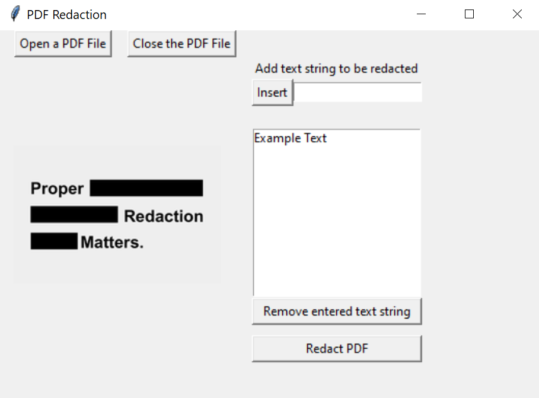
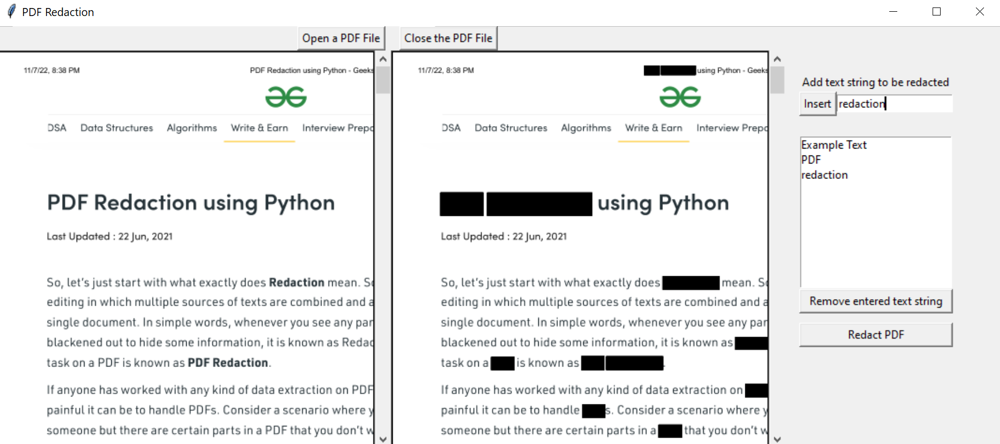

# PDF Redaction
A python redaction GUI built in TKinter.

### Features
#### Tkinter
- Basics: buttons, labels, entries
- Custom multi-open PDFs
- Object Oriented Window

### Usage
1. Place PDF in 
2. Use 'Open a PDF File' to select a PDF
3. Enter text string in dialog box, press 'Insert' to add to list
4. Select text string from dialog box and press 'Remove entered text string' to remove from list

5. Submit text redaction list with 'Redact PDF'  

7. Redacted text fields be displayed in side-by-side comparison
8. Redaction PDF is automatically exported with the pdf name '_redacted'

### Acknowledgements
- Displaying multiple PDFs in Tkinter: [link](https://stackoverflow.com/questions/70302939/tkpdfviewer-open-several-pdf-in-grid-not-working-display-same-pdf-with-a-mix)  
- PDF redaction code: [link](https://www.geeksforgeeks.org/pdf-redaction-using-python/)  
- Tkinter dialog box: [link](https://www.pythontutorial.net/tkinter/tkinter-open-file-dialog/)
